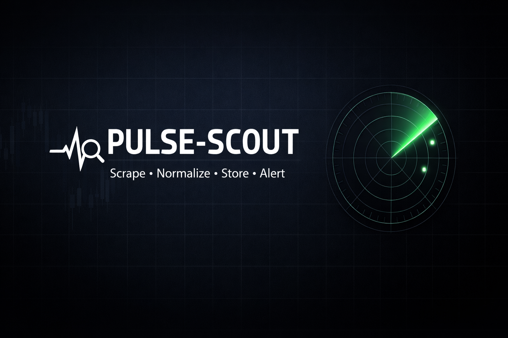

<p align="center">
    
</p>

# Pulse-Scout
**Pulse-Scout** est un projet de scraping d'opportunités marché, avec stockage local et visualisation simple.
Objectif v1 : mettre en place une chaîne complète **ingestion -> normalisation -> stockage -> visualisation**, sans complexité inutile.

---

## Objectifs du projet

- Collecter des données **prix / volume / date** depuis 1 à 2 sources simples
- Normaliser les données avec **Pandas**
- Stocker proprement dans une base **SQLite**
- Préparer le terrain pour :
    - alertes simples basées sur règles
    - dashboard interactif (Streamlit)
- Monter progressivement en compétences sur un pipeline data minimal mais réaliste

---

## Scope - v1 (actuelle)

Collecte depuis sources simples :
- CSV public
- API ouverte
- ou HTML très simple (pas de JS lourd)

Normalisation minimale :
- colonnes standardisées ('date', 'price', 'volume', 'source')
- types propres (datetime, float, int)

Stockage :
- SQLite
- schéma volontairement simple
- écriture via Pandas

Exécution :
- script unique, lancé manuellement
- logs rudimentaires (stdout + fichier)

Pas encore inclus :
- alertes automatiques
- planification (cron)
- dashboard avancé
- multi-assets complexes

---

## Stack technique

- **Python 3**
- **Pandas** - manipulation et normalisation des données
- **SQLite** - stockage local léger
- **Streamlit** - dashboard
- **Requests / BeautifulSoup** - scraping simple (selon source)

---

## Structure du projet (v1)

pulse-scout/
|--- assets/ # images, bannière README
|--- data/ # base SQLite et données locales
|--- logs/ # fichiers de logs
|--- README.md
|--- .gitignore
|--- main.py # script principal (à venir)

---

## Installation
```bash
python -m venv .venv
# Windows PowerShell
.venv\Scripts\activate
python -m pip install -r requirements.txt
```

## Ingestion (met à jour la base SQLite)
```bash
python main.py
```

## Dashboard
```bash
streamlit run app.py
```